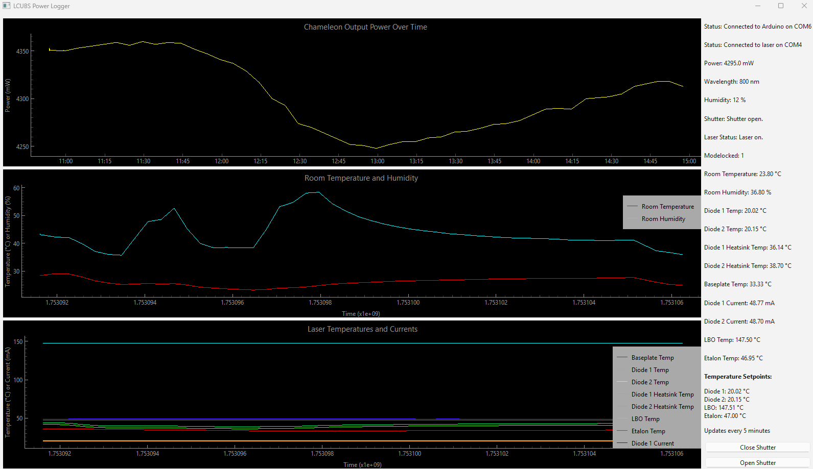

# power_logger
Simple Python program with GUI to log laser power and lab environmental data over time. 

Communicates with a laser and arduino over COM ports to log laser powers and lab environmental data (temperature, humidity). Python program and arduino sketch are in this repo. 

**Particularly useful if you need to get someone in university estates or building management to accept that a temperature swing of 10 celsius every day is going to make your experiments impossible.** 

As written will communicate with any of the [Coherent Ti:Sa Chameleon oscillators](https://www.coherent.com/lasers/oscillators/chameleon-ultra) (Ultra, Vision - tested specifically with a Chameleon Ultra II) and an Arduino (tested with [UNO R3](https://docs.arduino.cc/hardware/uno-rev3/)) with a standard [DHT22](https://thepihut.com/products/dht22-temperature-humidity-sensor-extras?srsltid=AfmBOoq4cPjbaSiShY9x_hGCs3yee1YSXKDcMNmTch24NBZMWcFC0K9k) temperature/humidity sensor attached. Other Coherent lasers may have the same syntax for serial communication so may also work, but have not been tested.

Records and plots graphs of output power, room temperature, humidity, and a variety of internal laser temperatures and diode currents as a function of time (default is every 5 minutes). A log file is saved of all these data (`power_log.txt`). 

Designed to be easy and quick to hack apart and edit if needed - serial communication is all done with `pyserial` and plotting with `pyqtgraph`. Should work out of the box for similar systems save some edits to COM ports and the arduino pins. 

